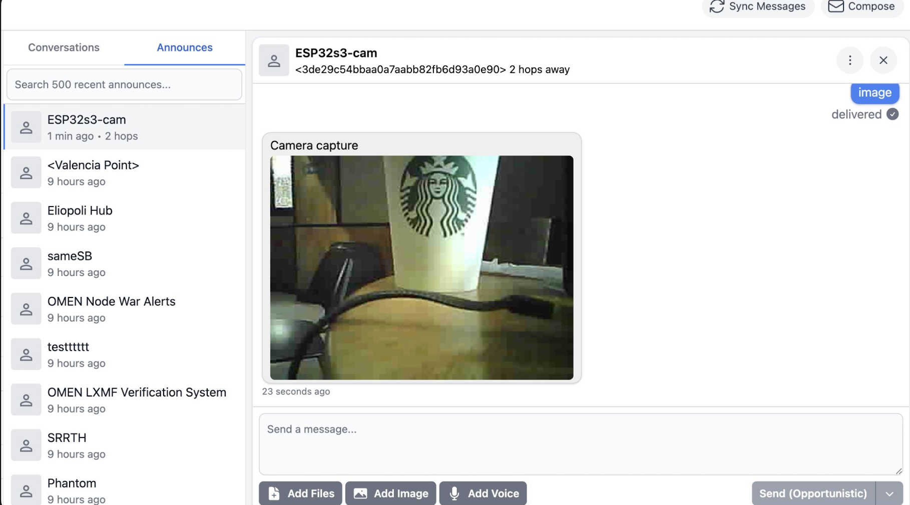

# µReticulum

A pure MicroPython implementation of the [Reticulum](https://reticulum.network/) network stack for ESP32-S3 and RP2040 microcontrollers. Send encrypted, signed messages from a $4 board to phones and laptops running [MeshChat](https://github.com/liamcottle/reticulum-meshchat), [Sideband](https://unsigned.io/sideband/), and [NomadNet](https://github.com/markqvist/NomadNet) — over WiFi, LoRa, or a TCP transport server.


[Youtube demo](https://youtu.be/Z38h_L_7n5E?si=eokB7pQE_kPDuqo0)

**Wire-compatible with reference Reticulum** — µReticulum nodes appear as normal peers in MeshChat / Sideband / NomadNet, with full LXMF messaging support and delivery receipts.

---

## What can I build with this?

Each row below is a working example in the `firmware/` folder. Pick the one closest to what you want, then follow the matching walkthrough further down.

| Goal | Example | Hardware | Connectivity |
|------|---------|----------|--------------|
| Chat with friends from a cheap board, control GPIO over LXMF | [`example_node.py`](#1--chat-node-example_nodepy) | ESP32-S3-Zero | WiFi |
| Run a tiny webserver-like portal reachable over Reticulum | [`example_nomadnet_node.py`](#2--nomadnet-page-server-example_nomadnet_nodepy) | ESP32-S3-Zero (+ optional sensors) | WiFi, LoRa, or TCP |
| Take a photo on demand and have it delivered as an LXMF attachment | [`example_camera_node.py`](#3--camera-node-example_camera_nodepy) | ESP32-S3-CAM + OV2640 | WiFi |
| Battery-powered sensor that wakes, reports, sleeps | [`example_sensor.py`](#4--sensor-node-with-deepsleep-example_sensorpy) | Any ESP32-S3 + sensor | WiFi |
| Pocket terminal: chat over LoRa using a USB serial cable, no app needed | [`example_proxy.py`](#5--usb-serial--lora-chat-bridge-example_proxypy) | RP2040 + E32/SX1262 LoRa | LoRa |

---

## Hardware shopping list

These are the boards µReticulum has been tested on. All are inexpensive and easy to find on Aliexpress / Amazon / Seeed / Waveshare.

| Board | Price | Good for | Notes |
|-------|------:|----------|-------|
| [Waveshare ESP32-S3-Zero](https://www.waveshare.com/wiki/ESP32-S3-Zero) | ~$4 | First-time users, chat/sensor/NomadNet nodes | ESP32-S3, 2 MB PSRAM, onboard NeoPixel LED, USB-C, 24.8 × 18 mm |
| [Seeed XIAO ESP32-S3](https://wiki.seeedstudio.com/xiao_esp32s3_getting_started/) + [Wio-SX1262 LoRa kit](https://wiki.seeedstudio.com/wio_sx1262_xiao_esp32s3_for_lora/) | ~$25 | LoRa + WiFi nodes that interop with RNode | XIAO + SX1262 stack |
| [ESP32-S3-CAM (OV2640)](https://www.aliexpress.com/item/1005008285512156.html) | ~$10 | Anything with the camera example | Many clones available — pick one with PSRAM |
| [Waveshare RP2040-Zero](https://www.waveshare.com/rp2040-zero.htm) + [EByte E32-900T20D](https://www.cdebyte.com/products/E32-900T20D/7) | ~$10 | Cheapest LoRa option, USB serial chat | Wiring + power notes in the [E32 LoRa Interface](#e32-lora-interface-ebyte-e32-900t20d) section |
| [LilyGO T-Deck](https://lilygo.cc/products/t-deck) v1 | ~$60 | Portable LoRa messenger with display + keyboard | Uses a separate GUI project: [reticulum-tdeck](https://github.com/varna9000/reticulum-tdeck) |

Should also work on other ESP32-S3 boards and Raspberry Pi Pico W. **Pure ESP32 (non-S3) is no longer supported** — the project targets ESP32-S3 and RP2040.

---

## Companion apps (run these on your laptop / phone)

µReticulum is the embedded peer — you talk to it from a desktop or phone app. Install at least one of these to actually use your node:

| App | Platform | What it gives you |
|-----|----------|-------------------|
| [MeshChat](https://github.com/liamcottle/reticulum-meshchat) | macOS, Windows, Linux, web | Chat + network visualizer. **Easiest first app.** Pairs over LAN UDP automatically. |
| [Sideband](https://unsigned.io/sideband/) | Android, Linux | Mobile-friendly chat, can join via LoRa hardware too |
| [NomadNet](https://github.com/markqvist/NomadNet) | Terminal (Linux/macOS) | Browse µReticulum-served pages (like a tiny web) |
| [Reticulum / RNS](https://github.com/markqvist/Reticulum) | Python | The reference stack and CLI tools (`rnstatus`, `rnpath`, `rnprobe`) |

If you only install one, install **MeshChat** — your node will appear in its peer list within a few seconds of booting on the same LAN.

---

## Installation

### Step 1 — Flash MicroPython to your board

You have two choices of firmware. Pick the one that matches what you want to build:

| Firmware | Use when | Download |
|----------|----------|----------|
| **Standard MicroPython 1.22+** | All examples *except* the camera node | [micropython.org/download/ESP32_GENERIC_S3](https://micropython.org/download/ESP32_GENERIC_S3/) |
| **MicroPython + camera driver** | **Required** for `example_camera_node.py` and any use of `peripherals.camera` | [micropython-camera-API releases](https://github.com/cnadler86/micropython-camera-API/releases) |

Standard MicroPython does **not** include the OV2640 camera driver — the camera-enabled build is mandatory if you want to use the camera. For everything else (chat, NomadNet pages, sensors, serial proxy) stick with the standard build.

Pick one of the two flashing methods below.

#### Option A — Thonny (easiest, no command line)

1. Install [Thonny](https://thonny.org/) and open it.
2. Plug your ESP32-S3 into USB. Hold the **BOOT** button while plugging in if the board doesn't enter download mode automatically.
3. In Thonny, go to **Tools → Options → Interpreter**.
4. Set *Interpreter* to **MicroPython (ESP32)** and pick your USB port.
5. Click **Install or update MicroPython** (bottom right).
6. In the dialog, choose:
   - **Target port**: your board's port
   - **MicroPython family**: `ESP32-S3`
   - **Variant**: matching your board (use `Espressif • ESP32-S3` for generic S3 boards like the Waveshare S3-Zero)
   - **Version**: latest stable
   - For the camera firmware, click *Select local MicroPython image* instead and point Thonny at the `.bin` you downloaded from the camera-API releases page.
7. Click **Install** and wait until it finishes. Close the dialog. Thonny is now connected to the REPL.

#### Option B — esptool (command line)

Install esptool once (`pip install esptool`), then with your board in download mode (hold **BOOT** while plugging USB):

```bash
# Wipe existing firmware first (recommended, especially when switching builds)
esptool.py --chip esp32s3 --port /dev/ttyACM0 erase_flash

# Standard MicroPython
esptool.py --chip esp32s3 --port /dev/ttyACM0 write_flash -z 0 ESP32_GENERIC_S3-<version>.bin

# OR: camera-enabled MicroPython
esptool.py --chip esp32s3 --port /dev/ttyACM0 write_flash -z 0 firmware_camera_esp32s3.bin
```

Replace `/dev/ttyACM0` with your port (`COM3` on Windows, `/dev/tty.usbmodem*` on macOS). After flashing, unplug and re-plug the board to exit download mode.

### Step 2 — Upload the firmware files

Upload the **contents** of the `firmware/` folder to the **root** of the microcontroller's filesystem. The `lib/` folder is included — it contains the native crypto and bz2 modules that make message delivery ~160× faster than pure Python. Don't skip it.

**With Thonny:** in the *Files* pane, drag every file and folder inside `firmware/` onto the device's root.

**With mpremote** (`pip install mpremote`):
```bash
mpremote cp -r firmware/ :
```

### Step 3 — Configure WiFi

Edit `config.py` on the device and set:

```python
WIFI_SSID = "YourNetwork"
WIFI_PASS = "YourPassword"
NODE_NAME = "MyNode"
```

If you'll use LoRa or TCP instead of WiFi, also enable the matching block in the `CONFIG["interfaces"]` list. See [Interfaces](#interfaces) below for the full reference.

### Step 4 — Run

In the Thonny REPL (or `mpremote repl`):

```python
import example_node
```

You should see boot output ending in something like:

```
[reticulum] Identity loaded: <hex hash>
[reticulum] WiFi UDP interface up on 192.168.1.42
[reticulum] Announced as MyNode
```

Open MeshChat on the same LAN — your node will appear as a peer within a few seconds.

To run a different example, replace `example_node` with `example_nomadnet_node`, `example_camera_node`, `example_sensor`, or `example_proxy`. To make any example run on boot, save it as `main.py` on the device.

---

## Example walkthroughs

### 1 — Chat node (`example_node.py`)

The default example. The node receives LXMF messages, echoes them back, and can drive the onboard NeoPixel from chat commands.

- **Hardware**: any supported ESP32-S3 board (WiFi). The onboard NeoPixel is on GPIO 21 on the Waveshare S3-Zero.
- **Firmware**: standard MicroPython.
- **Config**: WiFi SSID/password + a WiFi interface enabled in `CONFIG["interfaces"]`.
- **Usage from MeshChat**:

  | You send | What happens |
  |----------|--------------|
  | `red` | Onboard LED turns red |
  | `green` | LED turns green |
  | `blue` | LED turns blue |
  | `off` | LED turns off |
  | anything else | Echoed back to you |

Commands are case-insensitive. The same pattern can drive relays, motors, or any GPIO-attached hardware — see the [`gpio_control` peripheral](#peripherals).

### 2 — NomadNet page server (`example_nomadnet_node.py`)

Serves [micron-format](https://github.com/markqvist/NomadNet) pages over Reticulum Links. Think of it as a tiny web server reachable only via Reticulum.

- **Hardware**: any supported ESP32-S3 board. Optional sensors connected via I²C, UART, or ADC.
- **Firmware**: standard MicroPython.
- **Config**: WiFi (or LoRa / TCP) interface enabled.
- **How to use**: open NomadNet or MeshChat on another machine, wait for the announce as `nomadnetwork.node`, then browse to the node. The default landing page is `firmware/pages/index.mu`. Drop more `.mu` files into `firmware/pages/` to add more pages.

Template variables you can use inside a `.mu` page:

| Variable | Example output |
|----------|----------------|
| `{node_name}` | `MyNode` |
| `{mem_free}` | `7.6 MB` |
| `{uptime}` | `2h 15m 30s` |
| `{sensor}` | `Temperature: 24.44C, Pressure: 995.45hPa, Humidity: 100.00%` |

Pages under ~417 bytes ride a single encrypted link packet. Larger pages and downloadable files (up to 16 KB) are transferred automatically via the Resource protocol. Files dropped into `firmware/files/` are served at `/file/<name>` — link to them from a page with `` [label`:/file/name] ``.

### 3 — Camera node (`example_camera_node.py`)

Captures a photo with an OV2640 and ships it back as an LXMF image attachment. By
default it sends a **VGA (640 × 480) WebP** (~7 KB) — small enough for LoRa yet far
higher resolution than a same-size JPEG — and falls back to JPEG if the WebP encoder
isn't installed.



- **Hardware**: an ESP32-S3-CAM board with an OV2640 camera + PSRAM.
- **Firmware**: **camera-enabled MicroPython is mandatory** (see [Step 1](#step-1--flash-micropython-to-your-board)). Standard MicroPython will fail at `import camera`.
- **Config**: WiFi creds.
- **How to use**: send `image` from MeshChat / Sideband to get a photo back (delivered via a Link + Resource transfer). Send `help` or `settings` to see the live controls.
- **Image format & quality**: resolution, WebP quality, downscale, exposure, flash and night mode are all adjustable at runtime by messaging the node — see **[Camera image settings (JPEG & WebP)](docs/CAMERA_WEBP.md)** for every parameter and the size/quality trade-offs.
- **WebP encoder**: the optional native module `webp_fast.mpy` in `/lib` (built from [`tools/natmod/webp_fast/`](tools/natmod/webp_fast/)). Without it the node simply sends JPEG.

For direct (non-LXMF) capture you can also use the peripheral module from the REPL:

```python
from peripherals.camera import capture

# Save to flash
capture(resolution="cif", quality=30)

# In-memory only (for LXMF transmission)
img_bytes = capture(path=None, resolution="qvga", quality=15)
```

Available resolutions: `qqvga` (160 × 120), `qvga` (320 × 240), `cif` (400 × 296), `hvga` (480 × 320), `vga` (640 × 480), and several larger options.

### 4 — Sensor node with deepsleep (`example_sensor.py`)

A minimal LXMF client that boots, takes a reading, sends it to a fixed "hub" address, and goes back to deepsleep on a timer. Battery-friendly.

- **Hardware**: any supported ESP32-S3 + sensor (e.g. BME280 on I²C, SDS011 on UART).
- **Firmware**: standard MicroPython.
- **Config**: WiFi creds + `SENSOR_HUB = "<hex destination hash>"` in `config.py` (the LXMF address of your collector node — copy it from your collector's boot log or MeshChat).
- **How to use**: `import example_sensor`. Save as `main.py` for automatic restart-on-wake.

The deepsleep timer is set inside the example; change it to suit your duty cycle.

### 5 — USB serial ↔ LoRa chat bridge (`example_proxy.py`)

Turns an RP2040 with an attached LoRa radio (E32 or SX1262) into a transparent USB-to-Reticulum bridge — chat over LoRa from any laptop without installing MeshChat.

- **Hardware**: RP2040 (e.g. Waveshare RP2040-Zero) + a LoRa interface.
- **Firmware**: standard MicroPython for RP2040.
- **Config**: LoRa interface enabled in `CONFIG["interfaces"]`.
- **How to use**: plug the RP2040 into your laptop, open a serial terminal (`screen`, `minicom`, `tio`, `PuTTY`) on its USB CDC port. Type to chat.

| Command | Effect |
|---------|--------|
| `/help` | Show available commands |
| `/peers` | List known peers |
| `/to <hex>` | Set the current chat target by hex-hash prefix |
| `/me` | Show this node's LXMF address |
| `/name` | Show this node's display name |
| `/announce` | Broadcast identity now |
| `/quit` | Shutdown and return to the MicroPython REPL |

Anything that doesn't start with `/` is sent as an LXMF chat message to the current target. The current target auto-switches to the most recent peer who messaged you, so replies are automatic.

---

## Interfaces

Every interface is configured by an entry in the `CONFIG["interfaces"]` list in `config.py`. You can run multiple interfaces at the same time (e.g. WiFi + LoRa). The auto-generated `/rns/config.json` on the device mirrors this — you usually don't need to edit it by hand.

### WiFi UDP

The default. Broadcasts on the local LAN and pairs with MeshChat / Sideband automatically.

```python
{
    "type": "UDPInterface",
    "name": "WiFi UDP",
    "enabled": True,
    "listen_ip": "0.0.0.0",
    "listen_port": 4242,
    "forward_ip": None,       # None = auto-detected subnet broadcast
    "forward_port": 4242,
}
```

### Serial (RNode / generic LoRa)

HDLC-framed UART. Use this for an RNode device, a generic LoRa modem in transparent serial mode, or board-to-board wired links.

```python
{
    "type": "SerialInterface",
    "name": "Serial Link",
    "enabled": True,
    "uart_id": 2,
    "tx_pin": 17,
    "rx_pin": 16,
    "speed": 115200,
}
```

### SX1262 SPI LoRa interface (e.g. XIAO ESP32-S3 + Wio-SX1262)

Native SPI talk to the SX1262 radio. No external serial module needed.

**Prerequisite:** install the LoRa driver on the device once:

```bash
mpremote mip install lora-sx126x lora-sync
```

**Board pinout presets.** The board's wiring (SPI + control pins, TCXO, regulator) lives in `firmware/lora_boards.py` as named presets — you reference one with a `"board"` key and keep only the network/radio parameters in the interface entry:

```python
{
    "type": "LoRaInterface",
    "board": "esp32s3_cam_sx1262",   # pinout preset (lora_boards.py)
    "name": "LoRa SX1262",
    "enabled": True,
    "freq_khz": 868800,
    "sf": 8,
    "bw": "125",
    "coding_rate": 5,
    "tx_power": 14,
    "syncword": 0x1424,
}
```

The pins are merged in at startup. Any pin set explicitly on the interface overrides the preset, so you can tweak one pin without editing `lora_boards.py`.

**Built-in presets:**

| `board` | Hardware |
|---------|----------|
| `xiao_esp32s3_sx1262` | Seeed XIAO ESP32-S3 + Wio-SX1262 (kit) |
| `xiao_esp32s3_sx1262_header` | XIAO ESP32-S3 + Wio-SX1262 (header board) |
| `esp32s3_cam_sx1262` | ESP32-S3 WROOM CAM module + Wio-SX1262 |

**Adding a board:** add one entry to `LORA_BOARDS` in `firmware/lora_boards.py` with that board's `sck/mosi/miso/cs/busy/dio1/reset` pins (plus `dio2_rf_sw`, `dio3_tcxo_millivolts`, and optionally `use_dcdc` / `spi_baudrate`), then point an interface at it by name. Radio params stay in `config.py` so every node on the mesh shares them.

**Radio parameters** (interface entry — must match across the whole mesh)

- `freq_khz`: 868000 (EU), 915000 (US), 923000 (AS).
- `sf`: 7–12 (higher = longer range, slower).
- `bw`: `"125"` / `"250"` / `"500"` (lower = longer range, slower).
- `tx_power`: -9 to +22 dBm.
- `syncword`: `0x1424` — Reticulum/RNode-compatible.
- `dio2_rf_sw`: `True` on Wio-SX1262 (radio drives DIO2 as RF switch internally).
- `dio3_tcxo_millivolts`: `1800` on Wio-SX1262 (TCXO). `None` to disable (crystal-only modules).

### E32 LoRa interface (EByte E32-900T20D)

Transparent serial LoRa module ([product page](https://www.cdebyte.com/products/E32-900T20D/7)) with HDLC framing, AUX flow control, and optional auto-configuration of the module's hex registers.

```python
{
    "type": "E32Interface",
    "name": "LoRa E32",
    "enabled": True,
    "uart_id": 1,
    "tx_pin": 4,
    "rx_pin": 5,
    "speed": 9600,
    "m0_pin": 15,
    "m1_pin": 2,
    "aux_pin": 6,
    "auto_configure": False,
    "timeout": 3000,
    "channel": 6,
    "air_rate": 2,
    "tx_power": 3,
}
```

**Parameters**

- `channel`: freq = 862 + channel MHz. Channel 6 = 868 MHz (EU ISM), 60 = 922 MHz (US ISM).
- `air_rate`: 0 = 300 bps, 1 = 1200, 2 = 2400 (default), 3 = 4800, 4 = 9600, 5 = 19200.
- `tx_power`: 0 = 20 dBm, 1 = 17 dBm, 2 = 14 dBm, 3 = 10 dBm.
- `auto_configure`: `True` writes the channel/rate/power registers to the module's flash at boot. Set `False` once the module is configured.
- `timeout`: HDLC frame timeout in ms. Must be >2× the air time of a full packet. At 2400 bps a 182-byte announce takes ~760 ms, so 3000 ms is safe.

**Wiring (Waveshare RP2040-Zero example)**

| E32 Pin | Function | RP2040 GPIO |
|---------|----------|-------------|
| RXD | Module RX | GPIO 4 (UART1 TX) |
| TXD | Module TX | GPIO 5 (UART1 RX) |
| M0 | Mode select | GPIO 15 |
| M1 | Mode select | GPIO 2 |
| AUX | Busy signal | GPIO 6 |
| VCC | Power | 5 V |
| GND | Ground | GND |

**Pin gotcha:** on RP2040, do **not** use UART1 alternate-function pins (GPIO 3, 6, 7, 8) for M0/M1 — UART1 init claims them for CTS/RTS/TX and the resulting contention can damage the GPIO drivers. The driver also sets M0/M1 to 12 mA drive strength (vs the 4 mA default) so the E32's internal pull-ups release reliably.

**Power gotcha:** the E32-900T20D draws ~120 mA at 20 dBm TX. On RP2040-Zero this current spike will crash the MCU even off the 5 V USB rail. Use `tx_power: 3` (10 dBm, ~40 mA) unless the E32 has its own supply with decoupling.

### TCP client

Connects to a remote RNS TCP transport server. HDLC framing, wire-compatible with reference Reticulum's `TCPServerInterface`. Auto-reconnects on disconnect.

```python
{
    "type": "TCPClientInterface",
    "name": "Transport Hub",
    "enabled": True,
    "target_host": "rn.example.com",
    "target_port": 4243,
}
```

### IFAC (Interface Access Codes)

Add `networkname` and/or `passphrase` to *any* interface to require authentication. Both sides must use identical values.

```python
{
    "type": "TCPClientInterface",
    "name": "Authenticated TCP",
    "enabled": True,
    "target_host": "rn.example.com",
    "target_port": 4243,
    "networkname": "my_network",
    "passphrase": "my_secret_passphrase",
}
```

The optional `ifac_size` (default 16 bytes) controls the IFAC tag length and must match the server.

### Transport mode (full routing — turn a node into a relay)

Set `enable_transport: True` and the node becomes a **Reticulum transport router**: it forwards traffic between its interfaces so a LoRa-only mesh reaches the wider network and back. It is wire-compatible with reference RNS — a µReticulum router can sit transparently in a path between reference RNS, MeshChat, Sideband or NomadNet nodes.

This is **directed routing, not blind flooding**: the node learns routes from announces and forwards each packet on the *one* correct interface toward its destination, extending range without saturating the mesh. [`example_transport_router.py`](firmware/example_transport_router.py) is a ready-made LoRa ↔ WiFi/TCP router built on it.

```python
CONFIG = {
    "enable_transport": True,                   # this node relays for others
    "interfaces": [
        { "type": "LoRaInterface",      ... },  # the LoRa mesh side
        { "type": "TCPClientInterface", ... },  # the IP side (rnsd / MeshChat); or a UDPInterface
    ],
}
```

**What it carries** — everything, multi-hop, wire-compatible:

| Traffic | How the router handles it |
|---|---|
| **Announces** | re-broadcast with the router's transport id stamped in (so downstream nodes learn the route back), with jitter, retries, neighbour-suppression and per-source rate-limiting |
| **Opportunistic messages** (single-packet LXMF) | directed forward to the next-hop interface via the path table; the delivery **proof** returns along the recorded reverse path |
| **Link sessions** (MeshChat / Sideband / NomadNet) | a link table is built from the transit `LINKREQUEST`; in-link traffic is routed both ways, the link proof returns, and the link **MTU is clamped** at the LoRa↔IP boundary so packets still fit on the air |
| **Resource transfers** (large messages, ≤ 16 KB) | ride the link table automatically |
| **Path requests** | answered on demand by replaying the cached announce; unknown routes trigger recursive discovery |

Routing state lives in RAM-bounded tables: `path_table` (dest → next-hop + interface + hop count), `reverse_table` (proof return), `link_table` (link/resource transit), plus a small cache of recent announces.

**Resilience** (built for an open, long-running mesh): routing tables expire and are **purged when an interface drops** (WiFi-flap recovery); per-source announce rate-limiting and hard table caps prevent runaway memory; optional **strict link-proof validation** (native-gated Ed25519, ~17 ms); **blackholing** of misbehaving identities; and the **path table persists to flash** so a reboot isn't a mesh blackout.

**Watching it work**: every forward logs a `Relay …` line at `NOTICE` and bumps a counter, so you can follow relay activity in the console. The router example also serves a plain-HTTP dashboard on the LAN showing live `RELAYED ann/data/link/proof` counts, the path table, and the log stream.

**Running it headless**: a transport router usually runs without a USB cable, so it wants WiFi up at boot and a way back in to control it. [`boot.py`](firmware/boot.py) can bring up **WiFi + WebREPL** automatically on every reset — but it ships **commented out**, so a plain leaf node (LoRa-only, sensor, proxy) boots straight to the REPL instead of sitting through a needless ~15 s WiFi connect. Uncomment the execution block at the bottom of `boot.py` **only on a transport node**; you can then reach it at `ws://<node-ip>:8266/` (log in with `WEBREPL_PASSWORD` from `config.py`) to start/stop the router and push fixes over the air.

> A transport router wants the RAM headroom of an ESP32-S3 (PSRAM is ideal). Forwarding is single-instance (no shared-instance or tunnel interfaces) — most useful as a **LoRa ↔ IP gateway**.

### Probe responder (rnprobe)

Expose a dedicated destination that replies to `rnprobe`, the reference reachability/RTT tool. Useful for debugging transport paths.

```python
CONFIG = {
    "probe": {
        "enabled": True,
        "app_name": "urns",            # full_name = "urns.probe"
        "aspect": "probe",
        "announce_interval": 60 * 60,  # 1 hour; 0 = announce once at boot only
    },
    "interfaces": [...],
}
```

When enabled the boot log prints the destination hash and full name:

```
Probe address: 4a1b… (urns.probe)
```

From a desktop with reference RNS installed:

```bash
rnprobe urns.probe 4a1b…
```

Both `full_name` and `destination_hash` are required: announces only carry a hash of the name, so the dot-name has to be known out of band. A successful probe prints `Valid reply received from <hash>` with the measured RTT. The probe destination refuses link requests — it only signs PROOF replies. Other apps filter it out of their UIs by app_name.

### Time sync (clock for pure-LoRa nodes)

A LoRa-only node has no WiFi/NTP and no battery-backed RTC, so its clock sits at `2000-01-01` and every message/announce it sends is stamped *January 2000* (you'll see this on received images in MeshChat). Time sync fixes this by learning the real time **from the mesh itself** — every announce and every signed LXMF message already carries the sender's Unix timestamp.

```python
CONFIG = {
    "time_sync": {
        "enabled": True,
        "trusted_nodes": [],   # see modes below
        "min_sources": 2,      # corroboration quorum (when trusted_nodes is empty)
        "tolerance": 120,      # seconds of allowed disagreement between peers
    },
    "interfaces": [...],
}
```

Two modes:

- **Authority** — list one or more LXMF delivery hashes (hex, exactly as shown in MeshChat/Sideband) in `trusted_nodes`. The first announce or signed message from a matching node sets the clock. Fastest, and corrects time on the very first packet heard.
- **Corroboration** — leave `trusted_nodes` empty. The clock is set only once `min_sources` *distinct* peers agree on the time within `tolerance` seconds (the median is applied). No single node can move your clock, so you don't have to trust anyone in particular.

The sync runs **once per power-on**, only while the clock is still unset — it never re-adjusts mid-session. A reboot resets the RTC to 2000, and the node re-syncs from the next qualifying packet. After syncing, both outgoing message timestamps and announce timestamps are correct for the rest of the session.

> The ESP32's internal RTC keeps time only while powered — it does not survive a full power cycle. For instant-correct time at boot with no peer audible, add a battery-backed RTC (e.g. DS3231 over I²C).

---

## Peripherals

Modular hardware drivers in `firmware/peripherals/` with a uniform contract:

- `init(...)` — set up hardware
- `process(content)` — handle an LXMF message or page-template query, return a response string or `None`

| Module | Hardware | Triggers |
|--------|----------|----------|
| `bme280_sensor` | BME280 I²C sensor | Returns temperature / pressure / humidity when an incoming message contains `sensor` |
| `sds011_sensor` | SDS011 PM2.5 / PM10 UART sensor | Returns particulate matter readings when an incoming message contains `sensor` |
| `neopixel_led` | WS2812 NeoPixel LED | `red`, `green`, `blue`, `off` |
| `gpio_control` | Any GPIO pin | `<name> on`, `<name> off`, `<name>?` |
| `adc_reader` | ADC analog input | `<name>` — returns voltage + raw value |
| `camera` | OV2640 (camera firmware required) | Used by `example_camera_node.py` |

### Wiring example

Peripherals are initialized at the top of `example_nomadnet_node.py` (or `example_node.py`). Uncomment what you have:

```python
from machine import Pin, SoftI2C
i2c = SoftI2C(scl=Pin(6), sda=Pin(5), freq=100000)

import peripherals.bme280_sensor as bme_sensor
bme_sensor.init(i2c)

# import peripherals.neopixel_led as neopixel_led
# neopixel_led.init(pin=21)

# import peripherals.gpio_control as gpio
# gpio.init({"lamp": (2, "OUT")})

# import peripherals.adc_reader as adc_reader
# adc_reader.init({"battery": 1})

# import peripherals.sds011_sensor as sds011_sensor
# sds011_sensor.init(uart_id=1, tx_pin=43, rx_pin=44)

active_peripherals = [bme_sensor]
```

The SDS011 also needs `sds011_sensor.start()` inside the async event loop (see `run_with_announce()` in the example files) — that schedules a 5-minute duty cycle so the fan only runs during measurement.

**SDS011 wiring (XIAO ESP32-S3)**

| SDS011 Pin | Connect to |
|------------|------------|
| TX | GPIO 44 (`rx_pin`) |
| RX | GPIO 43 (`tx_pin`) |
| VCC (5 V) | VUSB |
| GND | GND |

The SDS011 needs 5 V power (VUSB, only available with USB-powered boards). Its UART TX is 3.3 V-safe — no level shifter needed.

Active peripherals are also queried for the `{sensor}` template variable in NomadNet pages. When multiple peripherals are active, all readings are shown.

---

## Troubleshooting

**WiFi won't connect**
- Double-check `WIFI_SSID` / `WIFI_PASS` in `config.py`. The ESP32-S3 only supports 2.4 GHz networks — a 5 GHz-only SSID will fail silently.
- Some routers separate 2.4 / 5 GHz under the same SSID; explicitly join the 2.4 GHz one if your router offers it.

**Node doesn't appear in MeshChat**
- The desktop running MeshChat and the µReticulum node must be on the **same LAN subnet** for UDP broadcast to reach across.
- If you have multiple NICs on the desktop (VPN, Docker bridge, virtual adapters), MeshChat may bind the wrong one. Disable interfaces you don't need.
- The example disables the WiFi access-point interface (`AP_IF`) and turns WiFi power-management off — both are required to receive broadcasts. If you've stripped that out of `example_node.py`, put it back.

**`ImportError: no module named 'lora'`**
- Run `mpremote mip install lora-sx126x lora-sync` once. This installs the SX126x driver from `micropython-lib` to the device.

**Native crypto module not loading (`ImportError: ed25519_fast`)**
- The `.mpy` file in `firmware/lib/` must match your architecture: `*_xtensawin.mpy` for ESP32-S3, `*_armv6m.mpy` for RP2040.
- The `.mpy` format is tied to a MicroPython version range. If your MicroPython is much newer than 1.22, see [BUILDING_NATIVE_MODULES.md](tools/natmod/BUILDING_NATIVE_MODULES.md) to rebuild.
- The system still works without the native module — just at ~4 s per message instead of <200 ms.

**LoRa: no packets received**
- Both ends must share `freq_khz`, `sf`, `bw`, `coding_rate`, and `syncword`. A single mismatch and you'll receive nothing.
- For SX1262 boards with a TCXO (Wio-SX1262), `dio3_tcxo_millivolts` must be set or the radio fails to init with `OpError 0x20`.
- For SX1262 boards in TX-but-no-output situations, check the regulator mode and TX power. The T-Deck v1 specifically needs DC-DC regulator mode (see [reticulum-tdeck](https://github.com/varna9000/reticulum-tdeck) for the workaround).

**RP2040 crashes when E32 transmits**
- The E32 draws ~120 mA at 20 dBm and that current spike can brown out the RP2040. Use `tx_power: 3` (10 dBm) or give the E32 its own supply with decoupling caps.

**`OSError: -202` or `OSError: -116`**
- Usually a WiFi-stack issue from too many open sockets after long uptime. Reset the board.

**Camera example fails with `ImportError: no module named 'camera'`**
- You're running standard MicroPython. The camera example requires the camera-enabled build — see [Step 1](#step-1--flash-micropython-to-your-board).

---

## Compatibility

Tested and confirmed working with:

- **MeshChat** — bi-directional announces, opportunistic messaging, delivery receipts
- **Sideband** — peer discovery, LXMF messaging
- **NomadNet** — peer discovery, LXMF messaging, page serving over Links
- **Reference Reticulum** (Python) — wire-compatible packets, announces, encryption, link handshake
- **Reference LXMF** — cross-validated message packing/unpacking, signature verification
- **RNode** (SX1276 / SX1278) — bidirectional LoRa, full split-packet support for the complete 500-byte MTU. Tested with Heltec Wireless Stick Lite V1 on 868 MHz.
- **RNS transport servers** — TCP client connectivity to remote transport hubs, automatic path learning from announces

---

## Performance on ESP32-S3

### With the native crypto module (default, recommended)

| Operation | Time |
|-----------|------|
| Ed25519 sign | **12 ms** |
| Ed25519 verify | **18 ms** |
| X25519 key exchange | **13 ms** |
| Receive + decrypt message | **~50 ms** |
| **Total message round-trip** | **<200 ms** |
| IFAC sign/verify per packet | **~15 ms** |

### Pure-Python fallback (no `.mpy` modules)

| Operation | Time |
|-----------|------|
| Receive + decrypt message | ~2 s |
| Verify Ed25519 signature | ~2 s |
| Sign + send proof | <1 s |
| **Total message round-trip** | **~4 s** |

The native C module (Monocypher-based) is ~160× faster than pure-Python Curve25519. Pre-built `.mpy` files for ESP32-S3 and RP2040 ship in `firmware/lib/` — they're loaded automatically when present. If you accidentally don't upload them, everything still works, just slowly.

---

## Limitations

- **MicroPython only** — no CPython/desktop support. Uses `uhashlib`, `ucryptolib`, `uasyncio`, `micropython.const` directly.
- **LXMF message size** — single-packet opportunistic messages up to ~295 bytes content. Larger messages (up to 16 KB) use Link-based DIRECT delivery via Resource transfer, including through multi-hop transport chains.
- **No propagation node** — cannot store-and-forward messages for offline peers.
- **On-demand path resolution** — when sending to a peer it has no route to (e.g. a transport-distant node right after a reboot), the node issues a Reticulum **path request** and delivers the message once the route is learned, instead of silently dropping it. Replies also reuse an already-open link when present.
- **Pure-Python crypto fallback** — ~4 s message round-trip without the native module. With native module: <200 ms.

## Roadmap

Potential areas for expansion:

- **Propagation node** — store-and-forward for offline peers
- **More sensor integrations** — additional peripheral drivers

---

## Protocol details

This section is the deep dive — you don't need any of it to use the project, but it's here for anyone interested in how it interoperates with reference Reticulum.

<details>
<summary><b>Message flow (MeshChat → ESP32-S3)</b></summary>

```
MeshChat                          ESP32-S3 (µReticulum)
   │                                    │
   ├─ LXMF announce ──────────────────► │ Validates Ed25519 signature
   │                                    │ Stores peer identity & display name
   │                                    │
   │ ◄────────────────── LXMF announce ─┤ Sends own announce (+ periodic re-announce)
   │ Peer appears in                    │
   │ network visualizer                 │
   │                                    │
   ├─ Encrypted LXMF message ────────► │ X25519 ECDH decrypt
   │  (e.g. "green")                    │ Unpack msgpack payload
   │                                    │ Verify Ed25519 signature
   │                                    │ Set NeoPixel color / echo reply
   │                                    │
   │ ◄──────────────── Delivery proof ──┤ Sign packet hash with Ed25519
   │ Shows "delivered"                  │ Send PKT_PROOF back
   │                                    │
   │ ◄────────── Echo reply (LXMF) ────┤ Encrypt + sign reply message
   │ Receives "Echo: green"            │ Send via opportunistic delivery
```

</details>

<details>
<summary><b>LXMF wire format</b></summary>

| Field | Size | Description |
|-------|------|-------------|
| Destination hash | 16 bytes | Truncated SHA-256 of destination |
| Source hash | 16 bytes | Truncated SHA-256 of source |
| Ed25519 signature | 64 bytes | Signs dest + source + payload + message_id |
| Payload (msgpack) | variable | `[timestamp, title, content, fields]` |

Total overhead: 112 bytes. Content capacity in a single encrypted packet: ~295 bytes.

Announces carry msgpack-encoded app data so peers know the node's display name:

```python
# Wire format: msgpack [name_bytes, stamp_cost]
# Example: [b"ESP32s3", None]
b'\x92\xc4\x07ESP32s3\xc0'
```

</details>

<details>
<summary><b>NomadNet link handshake</b></summary>

```
NomadNet Client                     ESP32-S3 (µReticulum)
   │                                       │
   ├─ Link Request (X25519 pub key) ─────► │ Generate ephemeral X25519 keypair
   │                                       │ ECDH shared secret → HKDF → AES-256 Token
   │                                       │
   │ ◄───── Link Proof (signature + pub) ──┤ Sign with destination Ed25519 identity
   │                                       │
   ├─ RTT (encrypted) ──────────────────► │ Link ACTIVE
   │                                       │
   ├─ Page Request (encrypted RPC) ──────► │ Decrypt, look up handler by path hash
   │                                       │ Read .mu file, substitute variables
   │ ◄──────── Page Response (encrypted) ──┤ Encrypt and send
```

Each link consumes ~350 bytes of RAM. Up to 4 concurrent links are supported (`MAX_ACTIVE_LINKS=4`). Idle links are cleaned up after 12 minutes.

</details>

<details>
<summary><b>SX1262 LoRa — RNode split-packet protocol</b></summary>

The LoRa interface implements the same split-packet framing as [RNode firmware](https://github.com/markqvist/RNode_Firmware), enabling transparent interop with RNode devices and support for Reticulum's full 500-byte MTU over LoRa's 255-byte frame limit.

Every LoRa frame carries a **1-byte RNode header**:

| Bits | Field | Description |
|------|-------|-------------|
| 7–4 | Sequence | Random 4-bit value for matching split halves |
| 0 | FLAG_SPLIT | Set when packet is split across 2 frames |

- **Single frame** (data ≤ 254 bytes): `[header] [data]` — max 255 bytes
- **Split packet** (data 255–508 bytes): two frames with the same header byte (same sequence + FLAG_SPLIT), back-to-back:
  - Frame 1: `[header] [first 254 bytes]` = 255 bytes
  - Frame 2: `[header] [remaining bytes]`

The receiver matches split frames by sequence number and reassembles them into a complete Reticulum packet. Stale fragments are discarded after 15 seconds.

The `lora-sx126x` MicroPython driver sends and receives bytes faithfully — the RNode header byte is the first byte returned by `poll_recv()` on RX and the first byte written by `send()` on TX. No FIFO offset workarounds are needed.

Packets with bit 7 set in the Reticulum flags byte (IFAC-tagged) are validated if IFAC is configured on the receiving interface, or dropped if IFAC is not configured. This matches reference Reticulum behavior.

</details>

<details>
<summary><b>ESP32-S3 socket workarounds</b></summary>

The UDP interface includes several workarounds for ESP32-S3 MicroPython lwIP quirks:

- **Single TX/RX socket** — saves ~280 bytes IDF heap vs two sockets.
- **`settimeout(0)` re-asserted after every `sendto()`** — ESP32-S3 lwIP bug: `sendto()` corrupts the socket's non-blocking state. Without this, `recvfrom()` silently blocks after the first send, freezing the async event loop.
- **No `select.poll()`** — `poll(0)` doesn't reliably detect incoming UDP on ESP32-S3 lwIP. Uses direct non-blocking `recvfrom()` + `except OSError` instead.
- **RX socket watchdog** — if the interface previously received traffic but hasn't for 60 seconds, the socket is closed and recreated.
- **WiFi power management disabled** — `wlan.config(pm=0)` is required to receive broadcast UDP packets.
- **AP_IF deactivated** — dual-interface mode routes broadcast packets to AP instead of STA, preventing UDP broadcast reception.

</details>

<details>
<summary><b>Native crypto module (.mpy details)</b></summary>

The native C module wraps [Monocypher](https://monocypher.org/) compiled to native machine code, distributed as a `.mpy` file alongside the Python code (no firmware recompile needed).

| Operation | Pure Python | Native C | Speedup |
|-----------|-------------|----------|---------|
| Ed25519 sign | 2 000 ms | 12 ms | **166×** |
| Ed25519 verify | 2 000 ms | 18 ms | **111×** |
| X25519 exchange | 1 400 ms | 13 ms | **107×** |

`.mpy` files are version 6 (MicroPython 1.19+) and architecture-specific:

| File | Architecture | Devices |
|------|--------------|---------|
| `ed25519_fast_xtensawin.mpy` | Xtensa (windowed) | ESP32-S3 |
| `ed25519_fast_armv6m.mpy` | ARM Cortex-M0+ | RP2040 (Pico W) |

Both ship pre-built in `firmware/lib/` and are loaded automatically. If a future MicroPython version changes the `.mpy` format, see [BUILDING_NATIVE_MODULES.md](tools/natmod/BUILDING_NATIVE_MODULES.md) for cross-compilation instructions.

</details>

<details>
<summary><b>Native BZ2 module</b></summary>

Reference RNS always compresses Resource transfers with bz2. The native C module provides **both compression and decompression**, producing stdlib-compatible bz2 output that interoperates with reference RNS.

- **Decompression**: ~100× faster than pure Python (~2 ms vs ~200 ms for 1 KB). Falls back to pure Python if native module is missing.
- **Compression**: ~500 ms for 1 KB on ESP32-S3. Reduces text payloads by 60–80% (e.g. 1 253 B → 394 B). Only available with native module — without it, Resources are sent uncompressed (which is valid).

| File | Architecture | Devices |
|------|--------------|---------|
| `bz2_fast_xtensawin.mpy` | Xtensa (windowed) | ESP32-S3 |
| `bz2_fast_armv6m.mpy` | ARM Cortex-M0+ | RP2040 (Pico W) |

</details>

---

## Project structure

```
uP-reticulum/
├── README.md
├── images/                      # README assets
├── tools/                       # Build tools, hardware docs, support files
│   ├── natmod/                  # Native C modules (ed25519_fast, bz2_fast)
│   ├── camera/                  # Camera board pinout, test scripts
│   └── ebyte/                   # E32/E220 datasheets
│
└── firmware/                    # ← Upload contents to microcontroller root
    ├── example_node.py          # LXMF messaging node with NeoPixel control
    ├── example_nomadnet_node.py # NomadNet page-serving node
    ├── example_camera_node.py   # OV2640 camera node (ESP32-S3-CAM)
    ├── example_sensor.py        # Sensor client with deepsleep
    ├── example_proxy.py         # USB serial ↔ LoRa chat bridge (RP2040)
    ├── config.py                # Node configuration (WiFi, interfaces)
    ├── lib/                     # Native C modules (.mpy) — auto-loaded
    ├── pages/                   # NomadNet micron-format pages
    ├── files/                   # Downloadable files served over Links
    ├── sensors/                 # Low-level sensor drivers
    ├── peripherals/             # Modular hardware drivers (LED, GPIO, ADC, sensors, camera)
    └── urns/                    # The Reticulum stack itself
        ├── reticulum.py         # Core init, config, async event loop
        ├── identity.py          # Identity, key generation, announce validation
        ├── destination.py       # Addressing, encryption, announces
        ├── packet.py            # Packet framing, proof generation, receipts
        ├── transport.py         # Directed routing / relay, path tables, announce propagation
        ├── link.py              # Reticulum Links (ECDH, RPC)
        ├── resource.py          # Resource protocol (segmented data)
        ├── lxmf.py              # LXMF message format, LXMRouter
        ├── interfaces/          # UDP, TCP, Serial, E32, SX1262
        └── crypto/              # X25519, Ed25519, AES, HKDF, HMAC, SHA, Token
```

---

## License

MIT

## Acknowledgments

Built on the [Reticulum](https://github.com/markqvist/Reticulum) protocol by Mark Qvist. The pure-Python Curve25519 implementation is derived from [pure25519](https://github.com/warner/python-pure25519) by Brian Warner.
