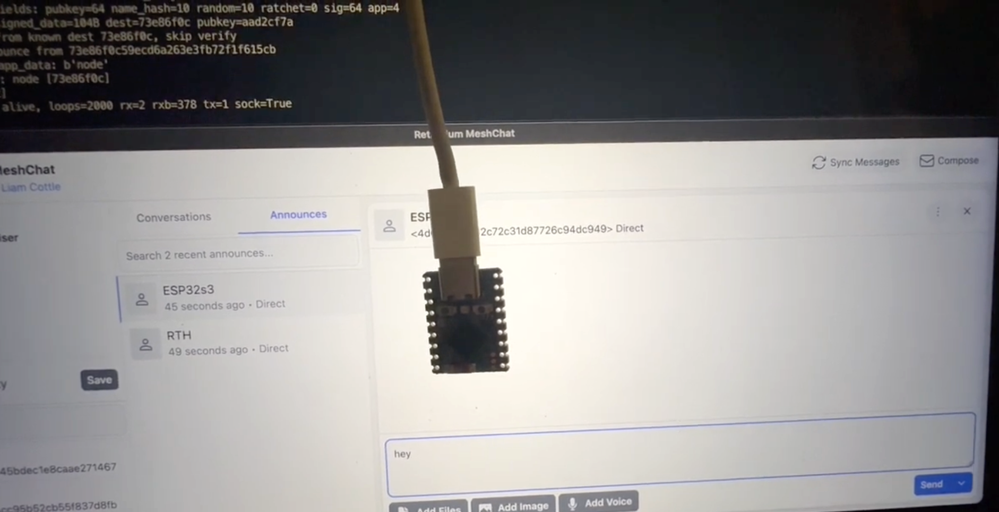

# µReticulum

A pure MicroPython implementation of the [Reticulum](https://reticulum.network/) network stack for ESP32 microcontrollers.





You an check also the [Youtube demo](https://youtu.be/Z38h_L_7n5E?si=eokB7pQE_kPDuqo0)


**Wire-compatible with reference Reticulum** — µReticulum nodes appear as standard peers in MeshChat, Sideband, and NomadNet. Full LXMF messaging support: send and receive encrypted, signed messages with delivery receipts.

## Target Hardware

Developed and tested on the [Waveshare ESP32-S3-Zero](https://www.waveshare.com/wiki/ESP32-S3-Zero) — a compact ($4) board with:

- ESP32-S3 dual-core LX7 @ 240MHz
- 4MB Flash, 2MB PSRAM, 512KB SRAM
- 2.4GHz WiFi (802.11 b/g/n) + Bluetooth 5 (LE)
- Onboard WS2812 NeoPixel LED (GPIO 21)
- USB-C, castellated pads, 24.8mm x 18mm

Also tested on [Seeed XIAO ESP32S3](https://wiki.seeedstudio.com/xiao_esp32s3_getting_started/) + [Wio-SX1262](https://wiki.seeedstudio.com/wio_sx1262_xiao_esp32s3_for_lora/) for LoRa communication.

Requires MicroPython 1.22+. Should also work on other ESP32-S3 boards and Raspberry Pi Pico W.

For the **LilyGO T-Deck** (ESP32-S3 + SX1262 + display + keyboard) with a GUI messenger, see [reticulum-tdeck](https://github.com/varna9000/reticulum-tdeck).

## What Works

- **LXMF Messaging** — Send and receive encrypted messages with MeshChat/Sideband, verify Ed25519 signatures, send delivery proofs (receipts). Messages show as "delivered" in MeshChat. Includes an echo bot example that auto-replies to incoming messages.
- **NeoPixel Control via LXMF** — Send color commands (`red`, `green`, `blue`, `off`) from MeshChat to control the onboard LED. Demonstrates using Reticulum as a hardware control channel.
- **Announce & Discovery** — ESP32 announces itself with an LXMF-compatible display name. Appears in MeshChat's network visualizer. Receives and parses announces from other peers.
- **Full Crypto Stack** — X25519 key exchange, Ed25519 signatures, AES-128-CBC encryption, HKDF, HMAC-SHA256 — all in pure Python, no C extensions.
- **Wire Protocol** — Byte-identical packet format to reference Reticulum. Validated bidirectionally against the reference implementation.
- **NomadNet Page Serving** — Serve micron-format pages to NomadNet clients over Reticulum Links. Full ECDH link handshake with request/response RPC. Pages and files of any size (up to 16KB) are automatically served via Resource transfer when they exceed a single packet.
- **File Serving** — Serve downloadable files from a `files/` directory. Files are registered as `/file/<filename>` handlers and linked from micron pages with `` [label`:/file/name] `` syntax. Large files are transferred via the Resource protocol.
- **Resource Transfer** — Wire-compatible segmented data transfer over Links for payloads exceeding a single packet (~417 bytes). Supports bz2 decompression, hash verification, and proof exchange. Confirmed working with MeshChat and NomadNet for both incoming and outgoing transfers.
- **Link MTU Negotiation** — Links negotiate MTU via signalling bytes in the handshake, matching reference Reticulum. Over TCP, Resource transfers use the full negotiated MTU (up to 16KB parts) instead of the base 500-byte MTU.
- **Transport Mode** — Blind flood forwarding between interfaces. Bridge WiFi and LoRa so packets from one interface are relayed to all others.
- **UDP Interface** — WiFi networking with auto-detected subnet broadcast. Non-blocking async I/O with ESP32 socket recovery.
- **TCP Client Interface** — HDLC-framed TCP connection to remote RNS transport servers. Automatic transport path routing: learns relay paths from HDR_2 announces and wraps outbound DATA packets for correct delivery through the transport server. Enables long-range connectivity beyond the local LAN.
- **SX1262 SPI LoRa Interface** — Native SPI control of SX1262 LoRa radios (e.g. Seeed XIAO ESP32S3 + Wio-SX1262). Implements RNode-compatible split-packet framing: packets up to 500 bytes are transparently split across two 255-byte LoRa frames, matching the exact protocol used by RNode firmware. Full interop with RNode (SX1276/SX1278) — bidirectional LXMF messaging, announces, and delivery proofs all work. RSSI/SNR reporting.
- **Serial Interface** — HDLC-framed UART for RNode, LoRa radios, packet radio TNCs, or ESP32-to-ESP32 links.
- **Persistent Identity** — Keys and known destinations survive reboots. JSON configuration.

## Installation

1. Flash MicroPython 1.22+ to your ESP32-S3
2. Upload the **contents** of the `firmware/` folder to the **root** of the microcontroller's filesystem using [Thonny](https://thonny.org/) or `mpremote`:
   ```bash
   # Using mpremote (upload everything inside firmware/ to device root)
   mpremote cp -r firmware/ :
   ```
3. Edit WiFi credentials in `example_node.py`:
   ```python
   WIFI_SSID = "YourNetwork"
   WIFI_PASS = "YourPassword"
   NODE_NAME = "ESP32s3"
   ```
4. Run:
   ```python
   import example_node
   ```

The node will connect to WiFi, announce itself, and begin receiving LXMF messages. It auto-replies with an echo of each message received. Open MeshChat on the same LAN and your ESP32 will appear as a peer.

### NeoPixel Control

The example node controls the onboard WS2812 NeoPixel LED via LXMF messages. Send any of these commands from MeshChat/Sideband:

| Message | Effect |
|---------|--------|
| `red` | LED turns red |
| `green` | LED turns green |
| `blue` | LED turns blue |
| `off` | LED turns off |

Commands are case-insensitive. Any other message is echoed back as a reply. This demonstrates using Reticulum as a control channel for IoT hardware — the same pattern works for relays, sensors, motors, or any GPIO-connected device.

## Project Structure

```
uP-reticulum/
├── README.md
├── ureticulum-crypto-optimization-report.md
├── images/                      # README assets
├── ebtye-e220-900/              # E220 hardware datasheet
│
└── firmware/                    # ← Upload contents to microcontroller root
    ├── example_node.py          # LXMF messaging node with NeoPixel control
    ├── example_nomadnet_node.py # NomadNet page-serving node
    ├── config.py                # Node configuration (WiFi, interfaces)
    ├── pages/                   # NomadNet micron-format pages
    ├── files/                   # Downloadable files served over Links
    ├── sensors/                 # Sensor drivers (e.g. bme280)
    ├── peripherals/
    │   ├── __init__.py          # Peripheral contract documentation
    │   ├── bme280_sensor.py     # BME280 temperature/pressure/humidity (I2C)
    │   ├── neopixel_led.py      # WS2812 NeoPixel RGB LED control
    │   ├── gpio_control.py      # GPIO pin on/off and state query
    │   └── adc_reader.py        # ADC analog voltage reader
    └── urns/
        ├── __init__.py          # Package entry point
        ├── const.py             # Protocol constants (matching reference RNS)
        ├── reticulum.py         # Core initialization, config, async event loop
        ├── identity.py          # Identity management, key generation, announce validation
        ├── destination.py       # Destination addressing, encryption, announce sending
        ├── packet.py            # Packet framing, proof generation, receipts
        ├── transport.py         # Packet routing, announce handling, interface management
        ├── link.py              # Server-side Reticulum Links (ECDH handshake, request/response)
        ├── resource.py          # Resource transfer protocol (segmented data over Links)
        ├── bz2dec.py            # Pure Python bz2 decompressor (for Resource payloads)
        ├── lxmf.py              # LXMF message format, LXMessage, LXMRouter
        ├── umsgpack.py          # Minimal MessagePack (subset needed for LXMF)
        ├── log.py               # Logging with configurable verbosity
        ├── interfaces/
        │   ├── __init__.py      # Base Interface class
        │   ├── udp.py           # WiFi UDP with broadcast discovery
        │   ├── tcp.py           # HDLC-framed TCP client (for RNS transport servers)
        │   ├── serial.py        # HDLC-framed UART (RNode, LoRa, ESP-to-ESP)
        │   └── lora.py          # SX1262 SPI LoRa with RNode-compatible split framing
        └── crypto/
            ├── x25519.py        # X25519 ECDH key exchange
            ├── ed25519.py       # Ed25519 signing/verification
            ├── aes.py           # AES-128/256-CBC encryption (via ucryptolib)
            ├── hkdf.py          # HKDF key derivation
            ├── hmac.py          # HMAC-SHA256
            ├── hashes.py        # SHA-256 (via uhashlib), SHA-512 (pure Python)
            ├── sha512.py        # SHA-512 (pure Python for Ed25519)
            ├── pkcs7.py         # PKCS7 padding
            ├── token.py         # Fernet-style token encryption
            └── pure25519/       # Curve25519 field arithmetic
                ├── _ed25519.py
                ├── basic.py
                ├── ed25519_oop.py
                └── eddsa.py
```

## How It Works

### Message Flow (MeshChat → ESP32)

```
MeshChat                          ESP32-S3 (µReticulum)
   │                                    │
   ├─ LXMF announce ──────────────────► │ Validates Ed25519 signature
   │                                    │ Stores peer identity & display name
   │                                    │
   │ ◄────────────────── LXMF announce ─┤ Sends own announce (+ periodic re-announce)
   │ Peer appears in                    │
   │ network visualizer                 │
   │                                    │
   ├─ Encrypted LXMF message ────────► │ X25519 ECDH decrypt
   │  (e.g. "green")                    │ Unpack msgpack payload
   │                                    │ Verify Ed25519 signature
   │                                    │ Set NeoPixel color / echo reply
   │                                    │
   │ ◄──────────────── Delivery proof ──┤ Sign packet hash with Ed25519
   │ Shows "delivered"                  │ Send PKT_PROOF back
   │                                    │
   │ ◄────────── Echo reply (LXMF) ────┤ Encrypt + sign reply message
   │ Receives "Echo: green"            │ Send via opportunistic delivery
   │                                    │
```

### LXMF Wire Format

Each LXMF message on the wire:

| Field | Size | Description |
|-------|------|-------------|
| Destination hash | 16 bytes | Truncated SHA-256 of destination |
| Source hash | 16 bytes | Truncated SHA-256 of source |
| Ed25519 signature | 64 bytes | Signs dest + source + payload + message_id |
| Payload (msgpack) | variable | `[timestamp, title, content, fields]` |

Total overhead: 112 bytes. Content capacity in a single encrypted packet: ~295 bytes.

### Announce App Data (LXMF)

Announces carry msgpack-encoded app data so peers know the node's display name:

```python
# Wire format: msgpack [name_bytes, stamp_cost]
# Example: [b"ESP32s3", None]
b'\x92\xc4\x07ESP32s3\xc0'
```

## Performance on ESP32-S3

| Operation | Time |
|-----------|------|
| Receive + decrypt message | ~2s |
| Verify Ed25519 signature | ~2s |
| Sign + send proof | <1s |
| **Total message round-trip** | **~4s** |
| Announce validation | ~6s |
| Free RAM after boot | ~63 KB |
| IDF heap after init | ~34 KB |
| IDF heap during runtime | ~3 KB free (stable) |

The bottleneck is pure-Python Curve25519 arithmetic. For a mesh messaging node on a $4 microcontroller, this is functional for real-world use.

### Memory Management

ESP32's MicroPython uses a split-heap architecture where the Python heap can expand into IDF (C runtime) heap. Crypto operations create large big-integer temporaries that fragment the split heap, permanently consuming IDF memory needed by lwIP for socket receive buffers.

Mitigations:
- **`gc.threshold(4096)`** during boot triggers early GC, reducing fragmentation-driven IDF expansion
- **`_gc_mask` tuning** — crypto loops call `gc.collect()` every N iterations. Boot uses aggressive GC (mask=1, every 2 iters) to prevent IDF heap expansion. After sockets are allocated, runtime switches to relaxed GC (mask=7/15) saving ~4s per message.
- **Pre-importing** `lxmf` and `umsgpack` in `urns/__init__.py` loads bytecode while heap is compact, before crypto key derivation fragments memory
- **Deferred interface setup** — UDP sockets are created after all Python imports, so lwIP gets accurate IDF headroom
- **`gc.threshold(-1)`** at runtime disables the aggressive threshold to avoid ~252 GC calls per Ed25519 verify

## Configuration

The node auto-generates `/rns/config.json` on first boot:

```json
{
  "identity": "<hex-encoded private key>",
  "interfaces": [
    {
      "type": "UDPInterface",
      "name": "WiFi UDP",
      "enabled": true,
      "listen_port": 4242,
      "forward_port": 4242,
      "forward_ip": null
    }
  ]
}
```

Setting `forward_ip` to `null` enables auto-detection of the subnet broadcast address.

### Serial Interface (for RNode / LoRa)

```json
{
  "type": "SerialInterface",
  "name": "Serial Link",
  "enabled": true,
  "uart_id": 2,
  "tx_pin": 17,
  "rx_pin": 16,
  "speed": 115200
}
```

### E220 LoRa Interface (EByte E220-900T)

Transparent LoRa radio with AUX flow control, AT auto-configuration, and chunked writes for packets exceeding the 400-byte hardware buffer.

```json
{
  "type": "E220Interface",
  "name": "LoRa E220",
  "enabled": true,
  "uart_id": 2,
  "tx_pin": 17,
  "rx_pin": 16,
  "speed": 9600,
  "m0_pin": 4,
  "m1_pin": 5,
  "aux_pin": 6,
  "auto_configure": true,
  "channel": 18,
  "air_rate": 2,
  "tx_power": 0,
  "lbt": true
}
```

### SX1262 SPI LoRa Interface (e.g. Seeed XIAO ESP32S3 + Wio-SX1262)

Native SPI LoRa using the `lora-sx126x` driver from `micropython-lib`. Talks directly to the SX1262 radio — no external UART module needed.

**Prerequisites:** Install the LoRa driver on your device first:

```
mpremote mip install lora-sx126x
```

```json
{
  "type": "LoRaInterface",
  "name": "LoRa SX1262",
  "enabled": true,
  "spi_bus": 1,
  "sck_pin": 7,
  "mosi_pin": 9,
  "miso_pin": 8,
  "cs_pin": 41,
  "busy_pin": 40,
  "dio1_pin": 39,
  "reset_pin": 42,
  "freq_khz": 868000,
  "sf": 7,
  "bw": "125",
  "coding_rate": 5,
  "tx_power": 14,
  "syncword": 5156,
  "dio2_rf_sw": true,
  "dio3_tcxo_millivolts": 1800
}
```

**Pin variants** — the pins above are for the Wio-SX1262 kit version. For the header board version use: CS=5, DIO1=2, RESET=3, BUSY=4. SPI pins (SCK/MOSI/MISO) are the same for both.

**Radio parameters:**
- `freq_khz`: 868000 (EU), 915000 (US), 923000 (AS)
- `sf`: 7–12 (higher = longer range, slower)
- `bw`: "125" / "250" / "500" (lower = longer range, slower)
- `tx_power`: -9 to +22 dBm
- `syncword`: 0x1424 (5156 decimal) — Reticulum/RNode compatible
- `dio2_rf_sw`: `true` — SX1262 internally drives DIO2 as RF switch (default, correct for Wio-SX1262)
- `dio3_tcxo_millivolts`: `1800` for Wio-SX1262 TCXO (default). Set `null` to disable for modules with a crystal oscillator instead of TCXO.

**Split-packet framing:** The SX1262 has a 255-byte packet limit while Reticulum's MTU is 500 bytes. The interface uses RNode-compatible split-packet framing: a 1-byte header is prepended to every LoRa frame (random 4-bit sequence in the upper nibble, FLAG_SPLIT in bit 0). Packets up to 254 bytes are sent as a single frame; larger packets are split across exactly two frames with matching sequence numbers — the same protocol used by RNode firmware. No configuration needed.

### TCP Client Interface

Connects to a remote RNS TCP server (e.g. a transport node). Uses HDLC framing, wire-compatible with reference Reticulum's `TCPServerInterface`. Auto-reconnects on connection loss.

```json
{
  "type": "TCPClientInterface",
  "name": "Transport Hub",
  "enabled": true,
  "target_host": "rn.example.com",
  "target_port": 4243
}
```

### Transport Mode

Enable transport mode to relay packets between interfaces. This turns your ESP32 into a bridge — for example, forwarding between WiFi and LoRa so that LoRa-only nodes can reach the wider network.

```json
{
  "enable_transport": true,
  "interfaces": [
    { "type": "UDPInterface", ... },
    { "type": "LoRaInterface", ... }
  ]
}
```

Transport uses blind flood forwarding: packets received on one interface are re-sent on all others (with hop count incremented). No path computation or routing tables — simple and RAM-friendly.

See `firmware/config.py` for all config variants (UDP, LoRa, TCP, dual WiFi+LoRa). Uncomment the interfaces you need.

## NomadNet Page Serving

µReticulum can serve [micron-format](https://github.com/markqvist/NomadNet) pages to NomadNet clients over Reticulum Links. This requires the full ECDH link handshake (3-packet exchange), after which the client can request pages via RPC.

### Running the NomadNet Node

1. Edit `config.py` with your WiFi credentials and interfaces
2. Upload the contents of `firmware/` to the device root (see [Installation](#installation))
3. Run:
   ```python
   import example_nomadnet_node
   ```

The node announces as `nomadnetwork.node` and serves pages from the `pages/` directory. Open NomadNet or MeshChat on another machine, discover the node, and browse to it.

### Page Files

Pages are `.mu` files in the `firmware/pages/` directory using NomadNet's [micron markup format](https://github.com/markqvist/NomadNet). Each file is automatically registered as a request handler at `/page/<filename>`.

Example `firmware/pages/index.mu`:
```
>Welcome to {node_name}

This node is running uReticulum on an ESP32.

>> Status
  Free memory: {mem_free}
  Uptime: {uptime}
```

Supported template variables (substituted at serve time):

| Variable | Description | Example output |
|----------|-------------|----------------|
| `{node_name}` | Node display name from config | `ESP32s3` |
| `{mem_free}` | Free heap memory (human-readable) | `7.6 MB` |
| `{uptime}` | Time since boot | `2h 15m 30s` |
| `{sensor}` | First active peripheral's sensor reading | `Temperature: 24.44C, Pressure: 995.45hPa, Humidity: 100.00%` |

To add more pages, just drop `.mu` files into `firmware/pages/` — they are picked up automatically on boot. For example, `firmware/pages/about.mu` would be served at `/page/about.mu`.

### Page and File Size Limits

Pages under ~417 bytes are served as single encrypted link packets. Larger pages and files (up to 16KB) are automatically served via the Resource transfer protocol — the same mechanism used by reference Reticulum. The 16KB limit (`MAX_RESOURCE_SIZE`) is a RAM-safety cap for ESP32.

### Link Handshake

When a NomadNet client connects, the following exchange occurs:

```
NomadNet Client                     ESP32 (µReticulum)
   │                                       │
   ├─ Link Request (X25519 pub key) ─────► │ Generate ephemeral X25519 keypair (~2s)
   │                                       │ ECDH shared secret → HKDF → AES-256 Token
   │                                       │
   │ ◄───── Link Proof (signature + pub) ──┤ Sign with destination Ed25519 identity
   │                                       │
   ├─ RTT (encrypted) ──────────────────► │ Link ACTIVE
   │                                       │
   ├─ Page Request (encrypted RPC) ──────► │ Decrypt, look up handler by path hash
   │                                       │ Read .mu file, substitute variables
   │ ◄──────── Page Response (encrypted) ──┤ Encrypt and send
   │                                       │
```

Each link consumes ~350 bytes of RAM. Up to 4 concurrent links are supported (`MAX_ACTIVE_LINKS=4`). Idle links are automatically cleaned up after 12 minutes.

## Peripherals

The `peripherals/` module provides modular hardware drivers with a uniform interface. Each peripheral follows the same contract:

- `init(...)` — set up hardware (pins, bus, etc.)
- `process(content)` — handle an LXMF message or page template query; return a response string or `None`

### Available Peripherals

| Module | Hardware | Commands / Usage |
|--------|----------|-----------------|
| `bme280_sensor` | BME280 I2C sensor | Returns temperature, pressure, humidity when message contains "sensor" |
| `neopixel_led` | WS2812 NeoPixel LED | `red`, `green`, `blue`, `off` — sets LED color |
| `gpio_control` | Any GPIO pin | `<name> on`, `<name> off`, `<name>?` — control or query pin state |
| `adc_reader` | ADC analog input | `<name>` — returns voltage and raw ADC value |

### Wiring

Peripherals are initialized in `firmware/example_nomadnet_node.py` (or `firmware/example_node.py`). Uncomment the ones you have connected:

```python
from machine import Pin, SoftI2C
i2c = SoftI2C(scl=Pin(6), sda=Pin(5), freq=100000)

import peripherals.bme280_sensor as bme_sensor
bme_sensor.init(i2c)

# import peripherals.neopixel_led as neopixel_led
# neopixel_led.init(pin=21)

# import peripherals.gpio_control as gpio
# gpio.init({"lamp": (2, "OUT")})

# import peripherals.adc_reader as adc_reader
# adc_reader.init({"battery": 1})

active_peripherals = [bme_sensor]
```

Active peripherals are queried for the `{sensor}` template variable in NomadNet pages, and can respond to LXMF message commands.

## Compatibility

Tested and confirmed working with:

- **MeshChat** — Bi-directional announces, opportunistic messaging, delivery receipts
- **Sideband** — Peer discovery, LXMF messaging
- **NomadNet** — Peer discovery, LXMF messaging, page serving over Links
- **Reference Reticulum** (Python) — Wire-compatible packets, announces, encryption, link handshake
- **Reference LXMF** — Cross-validated message packing/unpacking, signature verification
- **RNode** (SX1276/SX1278) — Bidirectional LoRa: announces, encrypted LXMF messages, delivery proofs. Full split-packet support for the complete Reticulum 500-byte MTU. Tested with Heltec Wireless Stick Lite V1 running RNode firmware on 868 MHz
- **RNS Transport Servers** — TCP client connectivity to remote transport hubs. Automatic path learning from announces: outbound DATA packets are wrapped as HDR_2 TRANSPORT for correct relay routing

## ESP32 Socket Workarounds

The UDP interface includes several workarounds for ESP32 MicroPython lwIP quirks:

- **Single TX/RX socket** — saves ~280 bytes IDF heap vs two sockets
- **`settimeout(0)` re-asserted after every `sendto()`** — ESP32 lwIP bug: `sendto()` corrupts the socket's non-blocking state. Without this, `recvfrom()` silently blocks after the first send, freezing the async event loop.
- **No `select.poll()`** — `poll(0)` doesn't reliably detect incoming UDP on ESP32 lwIP. Uses direct non-blocking `recvfrom()` + `except OSError` instead.
- **RX socket watchdog** — If the interface previously received traffic but hasn't for 60 seconds, the socket is closed and recreated.
- **WiFi power management disabled** — `wlan.config(pm=0)` is required to receive broadcast UDP packets.
- **AP_IF deactivated** — dual-interface mode routes broadcast packets to AP instead of STA, preventing UDP broadcast reception.

## SX1262 LoRa — RNode Split-Packet Protocol

The LoRa interface implements the same split-packet framing as [RNode firmware](https://github.com/markqvist/RNode_Firmware), enabling transparent interop with RNode devices and support for Reticulum's full 500-byte MTU over LoRa's 255-byte frame limit.

### How it works

Every LoRa frame carries a **1-byte RNode header**:

| Bits | Field | Description |
|------|-------|-------------|
| 7–4 | Sequence | Random 4-bit value for matching split halves |
| 0 | FLAG_SPLIT | Set when packet is split across 2 frames |

- **Single frame** (data ≤ 254 bytes): `[header] [data]` — max 255 bytes
- **Split packet** (data 255–508 bytes): Two frames with the same header byte (same sequence + FLAG_SPLIT), sent back-to-back:
  - Frame 1: `[header] [first 254 bytes]` = 255 bytes
  - Frame 2: `[header] [remaining bytes]`

The receiver matches split frames by sequence number and reassembles them into a complete Reticulum packet. Stale fragments are discarded after 15 seconds.

### Note on the `lora-sx126x` driver

The `lora-sx126x` MicroPython driver (`mpremote mip install lora-sx126x`) sends and receives bytes faithfully — the RNode header byte is the first byte returned by `poll_recv()` on RX and the first byte written by `send()` on TX. No FIFO offset workarounds are needed.

### IFAC filtering

Packets with bit 7 set in the Reticulum flags byte (IFAC-tagged) are dropped on receipt, since µReticulum does not implement Interface Access Codes. This matches reference Reticulum behavior for non-IFAC interfaces.

## Limitations

- **MicroPython only** — no CPython/desktop support. Uses `uhashlib`, `ucryptolib`, `uasyncio`, `micropython.const` directly.
- **Opportunistic LXMF only** — Single-packet messages up to ~295 bytes content for opportunistic delivery. Link-based LXMF delivery is supported for receiving larger messages (up to 16KB) via Resource transfer.
- **Server-side links only** — Can accept incoming links (for page serving), but cannot initiate outbound links.
- **No propagation nodes** — Cannot store-and-forward messages for offline peers.
- **Pure Python crypto** — ~4 second message round-trip on ESP32. `@micropython.viper` could significantly speed this up.

## What's Next

Potential areas for expansion:

- **Viper-accelerated crypto** — `@micropython.viper` native compilation for field arithmetic could bring X25519 from ~1.4s to ~0.2s
- **Client-side link LXMF delivery** — Initiate outbound links for direct LXMF delivery to peers
- **Propagation node** — Store-and-forward for offline peers

## License

MIT

## Acknowledgments

Built on the [Reticulum](https://github.com/markqvist/Reticulum) protocol by Mark Qvist. The pure Python Curve25519 implementation is derived from [pure25519](https://github.com/warner/python-pure25519) by Brian Warner.
